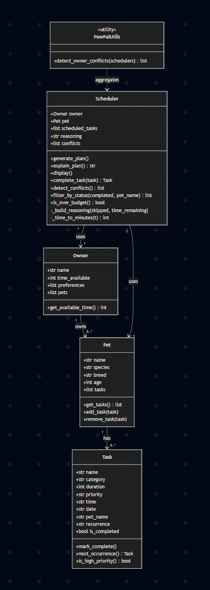

# PawPal+ (Module 2 Project)



You are building **PawPal+**, a Streamlit app that helps a pet owner plan care tasks for their pet.

## Scenario

A busy pet owner needs help staying consistent with pet care. They want an assistant that can:

- Track pet care tasks (walks, feeding, meds, enrichment, grooming, etc.)
- Consider constraints (time available, priority, owner preferences)
- Produce a daily plan and explain why it chose that plan

Your job is to design the system first (UML), then implement the logic in Python, then connect it to the Streamlit UI.

## What you will build

Your final app should:

- Let a user enter basic owner + pet info
- Let a user add/edit tasks (duration + priority at minimum)
- Generate a daily schedule/plan based on constraints and priorities
- Display the plan clearly (and ideally explain the reasoning)
- Include tests for the most important scheduling behaviors

## Features

- **Priority-based greedy scheduling** — tasks are sorted high → medium → low and added to the plan one at a time, stopping when the owner's time budget is exhausted; skipped tasks are never backfilled
- **Chronological time sorting** — after tasks are selected by priority, the final schedule is re-sorted by `HH:MM` time so the plan always reads in order across the day
- **Recurring task support** — tasks can be set to `daily` or `weekly`; completing a recurring task automatically generates a new instance with the correct next date (e.g. +1 day or +7 days), including across month and year boundaries
- **Per-pet conflict detection** — after generating a plan, every pair of scheduled tasks is checked for overlapping time windows; flagged conflicts include the task names and times so the owner can resolve them
- **Cross-pet conflict detection** — when multiple pets are scheduled, all tasks are compared across pets to catch cases where the owner would be needed in two places at once
- **Completion tracking and filtering** — tasks can be marked complete and the schedule can be filtered to show all, pending, or completed tasks, optionally scoped to a specific pet
- **Over-budget warning** — if scheduled tasks exceed the owner's available time the plan displays a warning with the total time used vs. available
- **Plain-English reasoning** — after each schedule is generated, a human-readable summary explains which tasks were included, which were skipped, and how much time remains

## Smarter Scheduling

The scheduler goes beyond basic priority sorting with several additional features:

- **Time-based sorting** — tasks are scheduled by priority to fit within the owner's time budget, then reordered chronologically by their `HH:MM` time so the final plan reads naturally across the day.
- **Recurring tasks** — tasks can be marked `"daily"` or `"weekly"`. Calling `Scheduler.complete_task()` marks the task done and automatically queues a new instance with the next calculated date (e.g. `2026-03-29` → `2026-03-30` for daily).
- **Completion filtering** — `Scheduler.filter_by_status(completed, pet_name)` returns pending or completed tasks, optionally scoped to a specific pet.
- **Per-pet conflict detection** — after `generate_plan()`, `Scheduler.detect_conflicts()` checks every pair of scheduled tasks for time window overlap and stores warnings in `scheduler.conflicts`. The schedule is not modified; warnings are returned so the owner can decide how to resolve them.
- **Owner-level conflict detection** — `detect_owner_conflicts(schedulers)` merges all pets' schedules and checks for cross-pet overlaps, catching cases where the owner cannot physically attend to two pets at the same time.

## Testing PawPal+

Run the full test suite with:

```bash
python -m pytest
```

The tests in `tests/test_pawpal.py` cover:

- **Task completion** — marking a task complete updates its status; completing a daily recurring task automatically creates a new task scheduled for the following day
- **Scheduling within budget** — tasks are selected by priority (high → medium → low) and only included if they fit the owner's remaining time; skipped tasks are never backfilled
- **Chronological ordering** — after `generate_plan()`, scheduled tasks are always returned in ascending time order regardless of the order they were added
- **Recurring task logic** — daily tasks advance by 1 day, weekly by 7 days, including across month and year boundaries; one-off tasks return `None` on completion
- **Conflict detection** — overlapping time windows on the same date are flagged; tasks on different dates or that are merely adjacent (no overlap) are not; duplicate start times are caught for both dated and undated tasks
- **Cross-pet conflicts** — `detect_owner_conflicts()` catches schedule overlaps across multiple pets and identifies which pets are involved
- **Filtering** — `filter_by_status()` correctly returns pending or completed tasks and respects an optional pet name filter

4 stars in confidence
## Getting started

### Setup

```bash
python -m venv .venv
source .venv/bin/activate  # Windows: .venv\Scripts\activate
pip install -r requirements.txt
```

### Suggested workflow

1. Read the scenario carefully and identify requirements and edge cases.
2. Draft a UML diagram (classes, attributes, methods, relationships).
3. Convert UML into Python class stubs (no logic yet).
4. Implement scheduling logic in small increments.
5. Add tests to verify key behaviors.
6. Connect your logic to the Streamlit UI in `app.py`.
7. Refine UML so it matches what you actually built.
